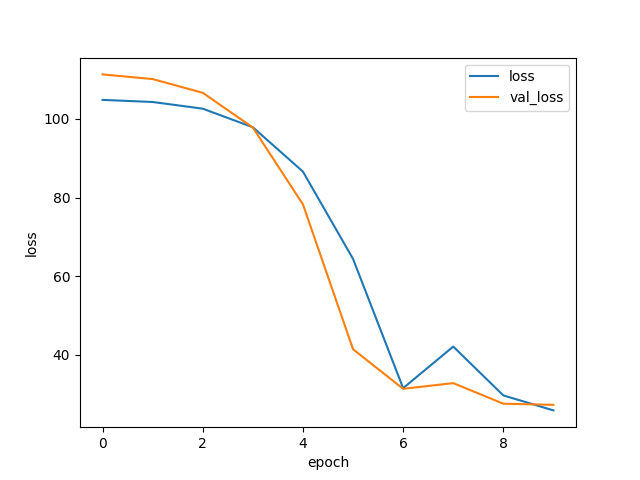

# Cereal Calorie Predictor

A PyTorch neural network that predicts cereal calorie content from nutritional ingredients.

Built as a hands-on ML exercise covering the full pipeline: data preprocessing, model training, evaluation, and prediction.

---

## What it does

- Trains a neural network on the [80 Cereals dataset](https://www.kaggle.com/datasets/crawford/80-cereals)
- Predicts calories from ingredients like fat, sugar, protein, sodium, etc.
- Caches the trained model so it only trains once
- Supports custom predictions via command line or Python REPL

---

## Stack

- Python, PyTorch, scikit-learn, pandas, NumPy, matplotlib

---

## Setup

```bash
pip install torch scikit-learn pandas numpy matplotlib joblib
```

Download `cereal.csv` from [Kaggle](https://www.kaggle.com/datasets/crawford/80-cereals) and place it in the project folder.

---

## Usage

**Train the model:**
```bash
python cereal.py --train
```

**Run on test data (uses cached model):**
```bash
python cereal.py
```

**Plot the loss curve:**
```bash
python cereal.py --plot
```

**Predict with custom ingredients:**
```bash
python cereal.py --data 'sugars=3, protein=5'
python cereal.py --data 'fat=10, sodium=20, carbo=15'
```

Unspecified fields default to the training set median.

---

## Results

Mean Absolute Error: ~28 calories on the test set.



---

## How it works

1. Loads and splits data into train / validation / test sets
2. Builds a preprocessing pipeline (median imputation + scaling for numeric, one-hot for categorical)
3. Trains a fully connected neural network with early stopping
4. Saves the trained model with joblib for fast reuse
5. Accepts custom input as a key=value string and fills missing features with medians

---

## Project structure

```
cereal.py      - Main script
cereal.csv     - Dataset (download from Kaggle)
cereal.pt      - Saved model (generated after training)
loss.png       - Loss curve (generated with --plot)
```
