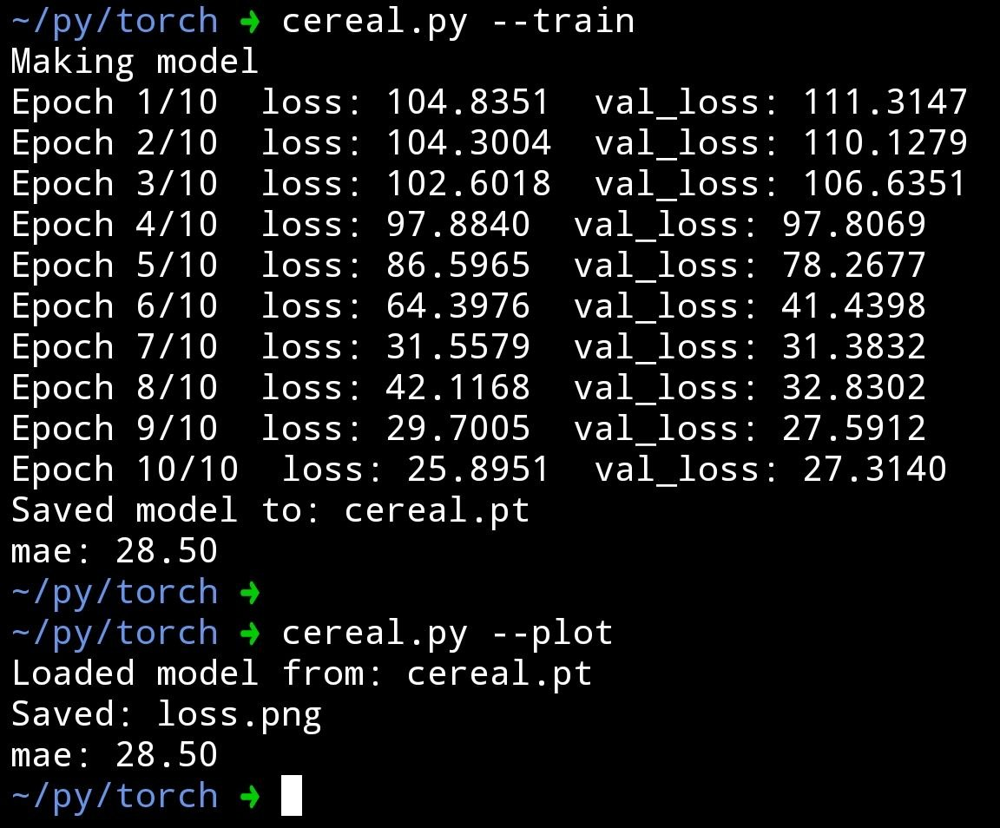
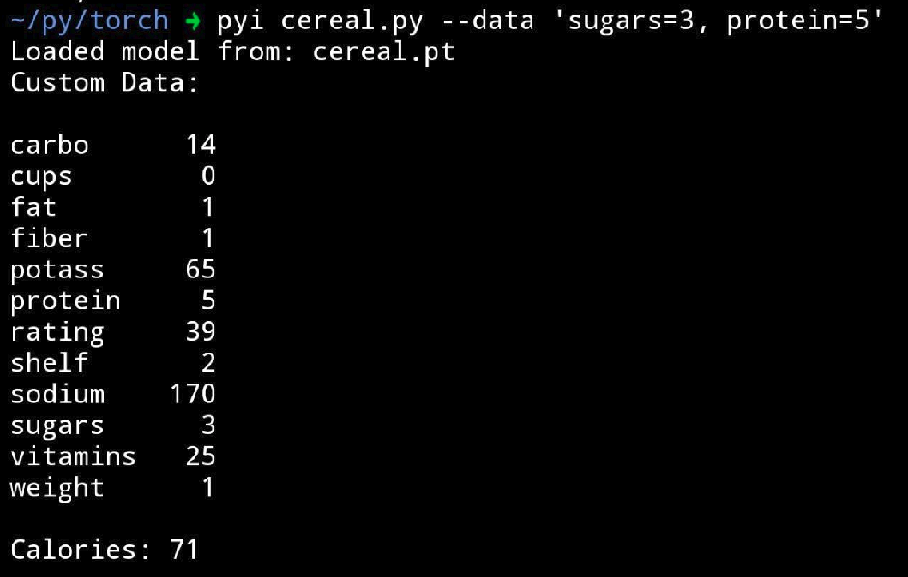
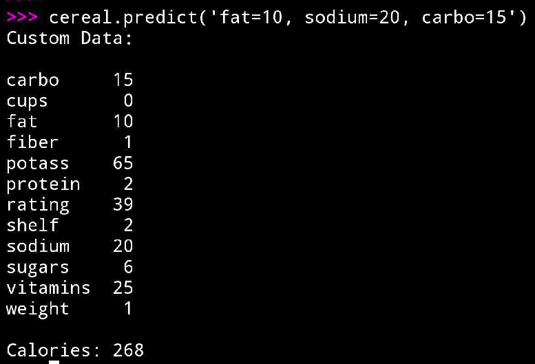

# cereal-ml

Simple PyTorch-based calorie prediction using cereal nutrition data.

Predict cereal calories from nutritional features using:
- CLI commands
- Python API calls
- Trained PyTorch models

---

## Features

- Train calorie prediction model from cereal nutrition data
- Save/load PyTorch models
- CLI predictions
- Python API predictions
- Loss plotting
- MAE evaluation
- Simple custom feature parser

---

## Installation

Clone the repo:

```bash
git clone https://github.com/poti1/cereal-ml.git
cd cereal-ml
```

Install dependencies:

```bash
pip install -r requirements.txt
```

---

## Training

Train the model:

```bash
./cereal.py --train
```

Example output:



Example training metrics:

```text
Epoch 1/10  loss: 104.8351  val_loss: 111.3147
...
Epoch 10/10 loss: 25.8951  val_loss: 27.3140

mae: 28.50
```

---

## CLI Prediction

Run predictions directly from the command line:

```bash
./cereal.py --data 'sugars=3, protein=5'
```

Example:



---

## Python API Usage

Use the predictor directly in Python:

```python
import cereal

cereal.predict('fat=10, sodium=20, carbo=15')
```

Example:



---

## Example Predictions

| Input | Predicted Calories |
|---|---|
| sugars=3, protein=5 | 71 |
| fat=10, sodium=20, carbo=15 | 268 |

---

## Plotting Loss

Generate a training loss plot:

```bash
./cereal.py --plot
```

This creates:

```text
loss.png
```


---

## Model Output

The trained model is saved as:

```text
cereal.pt
```

---

## Tech Stack

- Python
- PyTorch
- pandas
- matplotlib
- scikit-learn

---

## Goals

This project was built to practice:
- ML training pipelines
- Regression models
- Feature parsing
- Model serialization
- CLI + Python interfaces
- End-to-end ML workflows

---

## License

MIT
